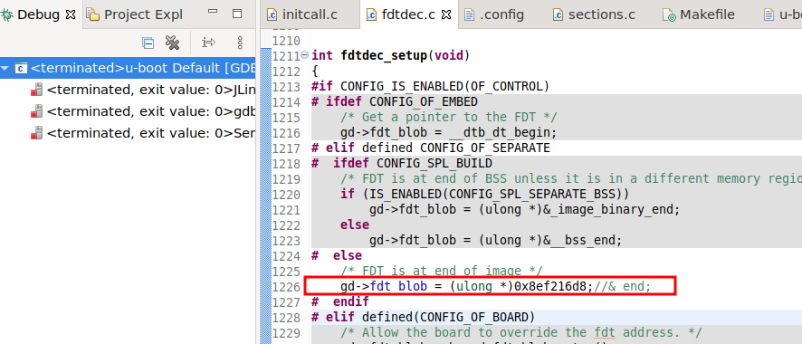

## GUI IDE for OpenWrt Development

This project makes two things:

1. Simplifies setup of [imx6ull-openwrt](https://github.com/wireless-road/imx6ull-openwrt) repository on local machine by avoiding inconsistency and incompatibility of different packages required to be installed to compile OpenWrt image for [imx6ull NetSoM](https://m2m-tele.com/product/netsom/)
2. Setups Eclipse as graphical IDE that lets to:
   1. navigate through source code using GUI instead command line utilities like [grep](https://man7.org/linux/man-pages/man1/grep.1.html) and [find](https://man7.org/linux/man-pages/man1/find.1.html).
   2. debug u-boot, kernel (not implemented yet) using external J-Link USB debugger connected to the [NetSoM Development Board](https://m2m-tele.com/product/imx6-development-board/) using JTAG interface:
   3. debug user layer application using onboard gdb server.


## Getting started

Clone the repository:
```
git clone https://github.com/wireless-road/openwrt-ide.git
```

Open `docker-compose.yml` and replace left side of `- /home/al/docker/ide/:/opt/eclipse/` volume declaration to the path you want openwrt sources and eclipse to be placed.
Then build a container:
```
$ docker-compose run --name openwrt openwrt
```
as a result you should get access to container's console. Next you have to setup Eclipse and openwrt sources by running:
```
$ ./setup_ide.sh
```
It makes few things:
1. clones OpenWrt sources from [imx6ull-openwrt](https://github.com/wireless-road/imx6ull-openwrt)
2. build simpliest device configuration image to get toolchain compiled.
3. installs eclipse.

As it finishes you should find `eclipse` and `imx6ull-openwrt` folders by `/opt/eclipse` path.
As eclipse has very limited possibilities for creation and configuration projects from command line but luckely it is portable we did a trick:
installed Eclipse on host machine at same path (`/opt/eclipse/eclipse`), created project from existing makefile project for `u-boot` sources (`kernel` project to be added soon, I hope), packet resulted folder to archive and here is preconfigured Eclipse installer. So don't move `eclipse` and `imx6ull-openwrt` folders to different pathes as it will brake Eclipse`s projects.

So after you finished setup (just once) you can start to work with source code using command line or eclipse GUI.

#### command line mode

just move to source code folder:

```
$ cd /opt/eclipse/imx6ull-openwrt
```

and here as usual like on the host machine:
```
$ ./compile.sh list
$ ./compile.sh <any available configuration>
```

the only pros of using docker image in that case is fastest way to getting started: no need to deal with possible troubles that might happens on requirements installation or sources compilation.


#### gui mode

launch eclipse:
```
$ /opt/eclipse/eclipse/eclipse
```


right click on project and press to `Clean Project`.
right click on project and press to `Build Project`:


##### dirty hack
The only dirty thing need to be done is hard code one line in source code. For that:

Type in U-boot console of running (not under debugger):
```
=> printenv fdtcontroladdr
fdtcontroladdr=8ef216d8
```
Then open `u-boot/lib/fdtdec.c`, navigate to `fdtdec_setup()` function and change:
```
gd->fdt_blob = &_end;
```
to:
```
gd->fdt_blob = (ulong *)0x8ef216d8;//&_end;
```


Now everything ready to debug.
to start debugging press `Run --> Debug Configurations`, select `u-boot Default` configuration and press `Debug`:

Eclipse suggests to swith to Debug perspective - accept it. Wait few seconds before image to be uploaded to hardware:

Don't mind about `no debug information available` message, just press to `Resume (F8)` button:

and navigate through the code.


#### container restarting

on exit from container console it stops:
```
$ exit
```

to enter it back:
```
$ docker start openwrt
$ docker exec -it openwrt bash
```

#### user layer applications development
here two developers guide to develop and debug user layer applications:
- [debugging u-boot. Detailed guide](https://m2m-tele.com/blog/2021/09/19/how-to-debug-u-boot/)
- [openwrt development and debugging using eclipse ide](https://m2m-tele.com/blog/2021/09/07/embedded-linux-development-and-remote-debugging-using-eclipse-ide/)
- [openwrt development and debugging using eclipse ide. part 2.](https://m2m-tele.com/blog/2021/09/07/embedded-linux-development-and-remote-debugging-using-eclipse-ide-part-2/)

