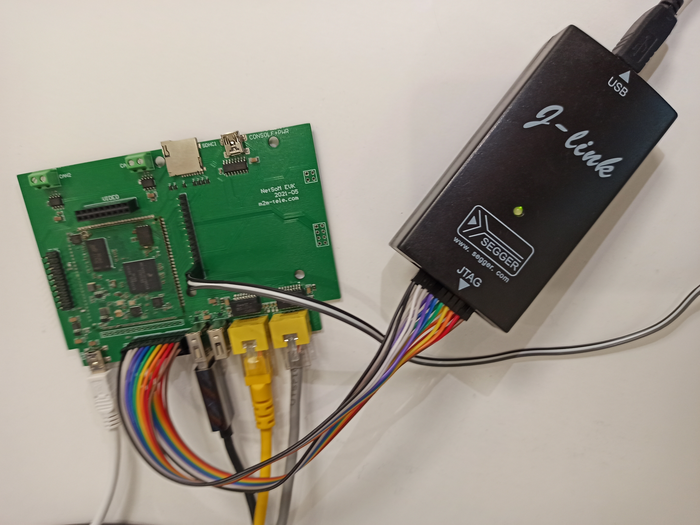
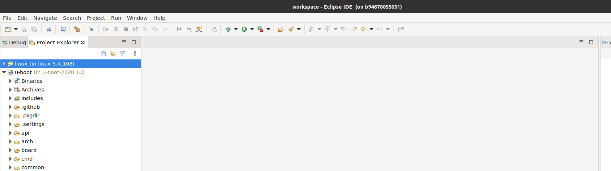
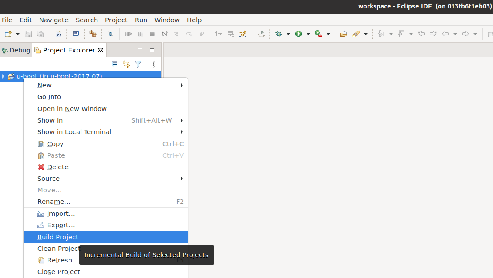
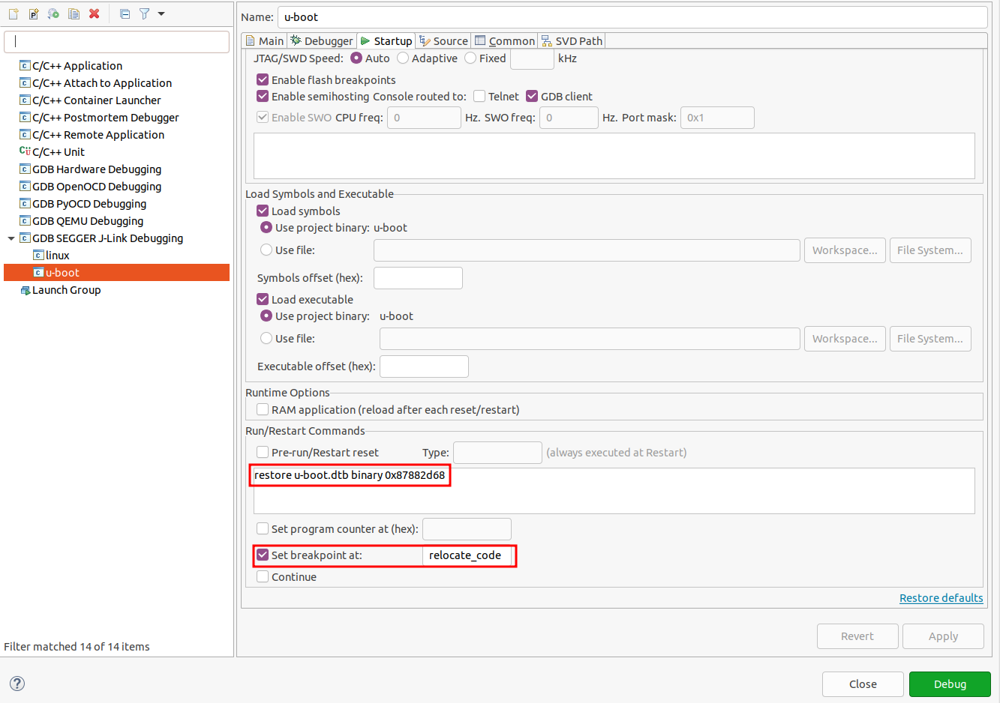
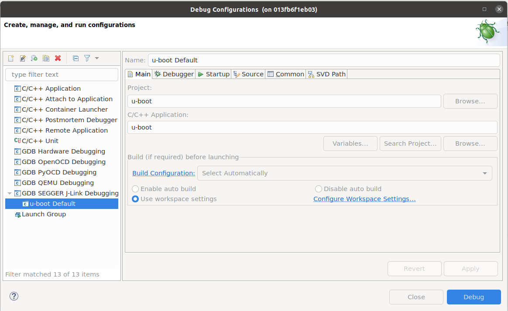
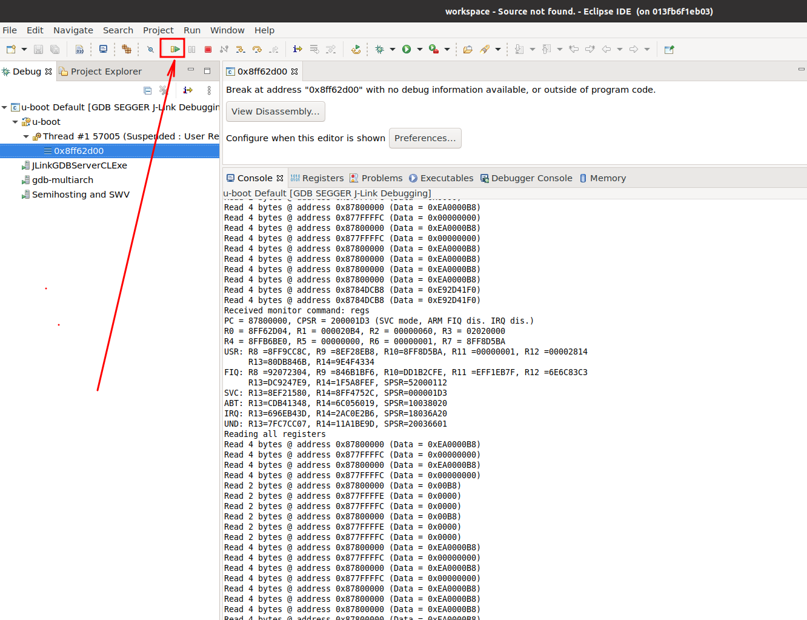
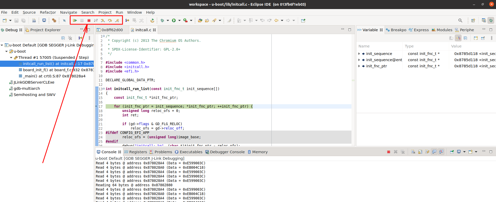
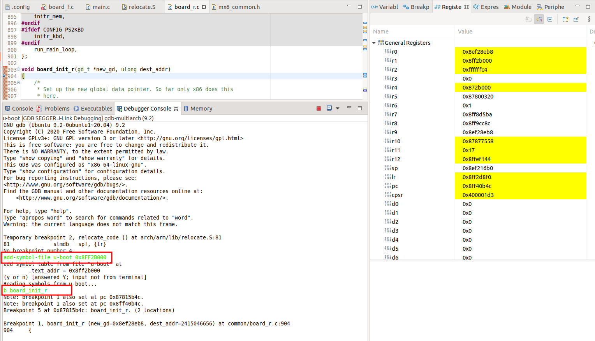

## GUI IDE for OpenWrt Development

This project makes two things:

1. Simplifies setup of [openwrt](https://github.com/wireless-road/openwrt/tree/imx6ull-2021-cand) repository on local machine by avoiding inconsistency and incompatibility of different packages required to be installed to compile OpenWrt image for [imx6ull NetSoM](https://m2m-tele.com/product/netsom/)
2. Setups Eclipse as graphical IDE that lets to:
   1. navigate through source code using GUI instead command line utilities like [grep](https://man7.org/linux/man-pages/man1/grep.1.html) and [find](https://man7.org/linux/man-pages/man1/find.1.html).
   2. debug u-boot, kernel (not implemented yet) using external J-Link USB debugger connected to the [NetSoM Development Board](https://m2m-tele.com/product/imx6-development-board/) using JTAG interface:
   3. debug user layer application using onboard gdb server.

<h2 id="table-of-contents">Table of contents</h2>

- [Compile images](#getting-started)
    - [Install IDE](#getting-started)
    - [Compile in console mode](#console-mode)
    - [Compile in GUI mode](#gui-mode)
- [Debugging U-boot](#debugging-u-boot)
    - [Console mode](#console-mode-2)
    - [Gui mode](#gui-mode-2)
- [Debugging Linux Kernel](#debugging-linux-kernel)
    - [Consolee mode](#console-mode-3)
- [Debugging U-boot and Kernel in same session](#debugging-u-boot-and-linux-kernel-in-same-session)
    - [Console mode](#console-mode-4)
- [IDE typical scenarios](#docker-commands)
- [Development guides](#development-guides)



<h2 id="getting-started">Getting started</h2>

Clone the repository:
```
https://github.com/wireless-road/openwrt-ide/tree/openwrt-2021.02
```

Open `docker-compose.yml` and replace left side of `- /home/al/docker/ide/:/opt/eclipse/` volume declaration to the path you want openwrt sources and eclipse to be placed.
Create that folder on host machine.
Then build a container:
```
$ docker-compose run --name openwrt openwrt
```
as a result you should get access to container's console. Next you have to setup Eclipse and openwrt sources by running:
```
$ . ./setup_ide.sh
```

Pay attention to "dot space dot slash" notation to execute script in current shell without foring a sub shell.

It makes few things:
1. clones OpenWrt sources from [imx6ull-openwrt](https://github.com/wireless-road/imx6ull-openwrt)
2. build simpliest device configuration image to get toolchain compiled.
3. installs eclipse.

After finishing you may find `/opt/eclipse` with inner `eclipse` and `imx6ull-openwrt` folders.

As eclipse has very limited possibilities for creation and configuration projects from command line but luckely it is portable we did a trick:
installed Eclipse on host machine at same path (`/opt/eclipse/eclipse`), created project from existing makefile project for `u-boot` sources (`kernel` project to be added soon, I hope), packet resulted folder to archive and here is preconfigured Eclipse installer. So don't move `eclipse` and `imx6ull-openwrt` folders to different pathes as it will brake Eclipse`s projects.

So after you finished setup (just once) you can start to work with source code using command line or eclipse GUI.

[back](#table-of-contents) 

<h3 id="console-mode">Compile in console mode</h3>

just move to source code folder:

```
$ cd /opt/eclipse/imx6ull-openwrt
```

and here as usual like on the host machine:
```
$ ./compile.sh list
$ ./compile.sh <any available configuration>
```

the only pros of using docker image in that case is fastest way to getting started: no need to deal with possible troubles that might happens on requirements installation or sources compilation.

[back](#table-of-contents) 

<h3 id="gui-mode">Compile in GUI mode</h3>

launch eclipse:
```
$ /opt/eclipse/eclipse/eclipse
```
Import existing project you want to work on as existing Makefile project. Guides to do that might be found [here](https://m2m-tele.com/blog/2021/09/07/embedded-linux-development-and-remote-debugging-using-eclipse-ide/) and [here](https://m2m-tele.com/blog/2021/09/07/embedded-linux-development-and-remote-debugging-using-eclipse-ide-part-2/).

Pre-installed u-boot and Linux kernel project might be found on Eclipse opening:



right click on project and press to `Clean Project`.
right click on project and press to `Build Project`:


[back](#table-of-contents) 

<h3 id="debugging-u-boot">Debugging U-boot</h3>
The unexpected thing you must keep in mind when you start debug U-boot is that it [relocates](https://source.denx.de/u-boot/u-boot/blob/HEAD/doc/README.arm-relocation) itself from one RAM memory address to another (to the end of RAM).


<h4 id="console-mode-2">Debugging U-boot in console mode</h4>
So in command line mode debugging you have to:

**0.** Compile u-boot first:

```
$ cd ~
$ ./compile_uboot_debuggable.sh
```

**1.** Start GDB server:
```
$ jl_server
```
**2.** Start GDB session:
```
$ cd /opt/eclipse/imx6ull-openwrt/build_dir/target-arm_cortex-a7+neon-vfpv4_musl_eabi/u-boot-wirelessroad_ecspi3/u-boot-2020.10/
$ jl_uboot
```
**3.** Use `/gdb_script/u-boot.txt` script to debug U-boot:

**3.1.** connect to remote target and load image:

```
(gdb) set confirm off
(gdb) target remote localhost:2331
Remote debugging using localhost:2331
Cannot access memory at address 0x8000004
Cannot access memory at address 0x8000000
Cannot access memory at address 0x8000004
0x8ff5cfc4 in ?? ()
(gdb) monitor reset
Resetting target
(gdb) monitor halt
(gdb) monitor sleep 200
Sleep 200ms
(gdb) load
Loading section .text, size 0x3a8 lma 0x87800000
Loading section .efi_runtime, size 0xf68 lma 0x878003a8
Loading section .text_rest, size 0x7aec4 lma 0x87801320
Loading section .rodata, size 0x16f42 lma 0x8787c1e8
Loading section .hash, size 0x18 lma 0x8789312c
Loading section .data, size 0x7bf4 lma 0x87893148
Loading section .got.plt, size 0xc lma 0x8789ad3c
Loading section .u_boot_list, size 0x126c lma 0x8789ad48
Loading section .efi_runtime_rel, size 0xd0 lma 0x8789bfb4
Loading section .rel.dyn, size 0x10198 lma 0x8789c084
Loading section .dynsym, size 0x30 lma 0x878ac21c
Loading section .dynstr, size 0x1 lma 0x878ac24c
Loading section .dynamic, size 0x90 lma 0x878ac250
Loading section .gnu.hash, size 0x18 lma 0x878ac2e0
Start address 0x87800000, load size 705243
Transfer rate: 69 KB/sec, 13060 bytes/write.
(gdb) load
Loading section .text, size 0x3a8 lma 0x87800000
Loading section .efi_runtime, size 0xf68 lma 0x878003a8
Loading section .text_rest, size 0x7aec4 lma 0x87801320
Loading section .rodata, size 0x16f42 lma 0x8787c1e8
Loading section .hash, size 0x18 lma 0x8789312c
Loading section .data, size 0x7bf4 lma 0x87893148
Loading section .got.plt, size 0xc lma 0x8789ad3c
Loading section .u_boot_list, size 0x126c lma 0x8789ad48
Loading section .efi_runtime_rel, size 0xd0 lma 0x8789bfb4
Loading section .rel.dyn, size 0x10198 lma 0x8789c084
Loading section .dynsym, size 0x30 lma 0x878ac21c
Loading section .dynstr, size 0x1 lma 0x878ac24c
Loading section .dynamic, size 0x90 lma 0x878ac250
Loading section .gnu.hash, size 0x18 lma 0x878ac2e0
Start address 0x87800000, load size 705243
Transfer rate: 69 KB/sec, 13060 bytes/write.
```

**3.2.** Restore binary device tree by appending u-boot.dtb file at the end of u-boot image:

```
(gdb) b fdtdec_prepare_fdt
Breakpoint 1 at 0x87870be4: file lib/fdtdec.c, line 587.
(gdb) c
Continuing.

Breakpoint 1, fdtdec_prepare_fdt () at lib/fdtdec.c:587
587		if (!gd->fdt_blob || ((uintptr_t)gd->fdt_blob & 3) ||
(gdb) set gd->fdt_blob = _end
(gdb) restore u-boot.dtb binary _end
Restoring binary file u-boot.dtb into memory (0x878ac21c to 0x878b38bb)
```

**3.3.** Handle code relocation:

```
(gdb) b setup_reloc
Breakpoint 2 at 0x8781a874: file common/board_f.c, line 680.
(gdb) c
Continuing.

Breakpoint 2, setup_reloc () at common/board_f.c:680
680		if (gd->flags & GD_FLG_SKIP_RELOC) {
(gdb) p /x gd->relocaddr
$1 = 0x8ff37000
(gdb) set $s = gd->relocaddr
(gdb) add-symbol-file u-boot $s
add symbol table from file "u-boot" at
	.text_addr = 0x8ff37000
Reading symbols from u-boot...
(gdb) b relocate_code
Breakpoint 3 at 0x87801bc4: file arch/arm/lib/relocate.S, line 81.
(gdb) c
Continuing.

Breakpoint 3, relocate_code () at arch/arm/lib/relocate.S:81
81		ldr	r1, =__image_copy_start	/* r1 <- SRC &__image_copy_start */
(gdb) p /x $pc
$5 = 0x87801bc4
(gdb) fin
Run till exit from #0  relocate_code () at arch/arm/lib/relocate.S:81
?? () at arch/arm/lib/crt0.S:145
145		bl	relocate_vectors
(gdb) p /x $pc
$6 = 0x8ff386a8
```

**3.4.** Pass till the end to jump to kernel:

```
(gdb) b boot_jump_linux
Breakpoint 4 at 0x87801cd0: boot_jump_linux. (2 locations)
(gdb) c
Continuing.

Breakpoint 4, boot_jump_linux (images=images@entry=0x8ffd3bcc, flag=flag@entry=1024) at arch/arm/lib/bootm.c:378
378		unsigned long machid = gd->bd->bi_arch_number;
(gdb) n
384		kernel_entry = (void (*)(int, int, uint))images->ep;
(gdb) n
389		s = env_get("machid");
(gdb) n
390		if (s) {
(gdb) n
400		bootstage_mark(BOOTSTAGE_ID_RUN_OS);
(gdb) n
401		announce_and_cleanup(fake);
(gdb) n
403		if (IMAGE_ENABLE_OF_LIBFDT && images->ft_len)
(gdb) n
404			r2 = (unsigned long)images->ft_addr;
(gdb) n
406			r2 = gd->bd->bi_boot_params;
(gdb) n
408		if (!fake) {
(gdb) n
416				kernel_entry(0, machid, r2);
```
[back](#table-of-contents) 

<h4 id="gui-mode-2">Debugging U-boot in GUI mode</h4>

To start debugging press `Run --> Debug Configurations`, select `u-boot Default` configuration.
Pay attention for following settings:

Then press `Debug`:

Eclipse suggests to swith to Debug perspective - accept it. Wait few seconds before image to be uploaded to hardware:

Don't mind about `no debug information available` message, just press to `Resume (F8)` button:

and navigate through the code. If you left breakpoint unchanged it should stop you at `relocate_code` function. So to pass relocation successfully you should manually place `u-boot` image at relocation address. For that open `Debugger Console` and type commands explained before:

Than you can continue to debug code even after relocation.

[back](#table-of-contents) 

<h3 id="debugging-linux-kernel">Debugging Linux Kernel</h2>

<h4 id="console-mode-3">Debugging Linux Kernel in console mode</h2>

First, power up device and press enter on u-boot countdown to prevent linux kernel loading.

1. Enter Linux kernel sources folder:

```
cd /opt/eclipse/imx6ull-openwrt/build_dir/target-arm_cortex-a7+neon-vfpv4_musl_eabi/linux-imx6ull_cortexa7/linux-5.4.168/
```

2. make sure that debugging optimized build option selected in `.config` file:

```
$ cat .config | grep OPTIMIZE
CONFIG_CC_OPTIMIZE_FOR_PERFORMANCE=y
# CONFIG_CC_OPTIMIZE_FOR_SIZE is not set
# CONFIG_CC_OPTIMIZE_FOR_DEBUGGING is not set
```
3. build kernel image:

```
make -j $(nproc) uImage LOADADDR=0x80008000
```

4. start GDB server:

```
$ jl_server 
SEGGER J-Link GDB Server V7.54b Command Line Version

JLinkARM.dll V7.54b (DLL compiled Sep 14 2021 16:11:24)

Command line: -device MCIMX6Y2 -if JTAG -speed 1000
-----GDB Server start settings-----
GDBInit file:                  none
GDB Server Listening port:     2331
SWO raw output listening port: 2332
Terminal I/O port:             2333
Accept remote connection:      yes
Generate logfile:              off
Verify download:               off
Init regs on start:            off
Silent mode:                   off
Single run mode:               off
Target connection timeout:     0 ms
------J-Link related settings------
J-Link Host interface:         USB
J-Link script:                 none
J-Link settings file:          none
------Target related settings------
Target device:                 MCIMX6Y2
Target interface:              JTAG
Target interface speed:        1000kHz
Target endian:                 little

Connecting to J-Link...
J-Link is connected.
Firmware: J-Link ARM V8 compiled Nov 28 2014 13:44:46
Hardware: V8.00
Feature(s): RDI,FlashDL,FlashBP,JFlash,GDB
Checking target voltage...
Target voltage: 3.32 V
Listening on TCP/IP port 2331
Connecting to target...

J-Link found 3 JTAG devices, Total IRLen = 13
JTAG ID: 0x5BA00477 (Cortex-A7)
Connected to target
```

5. start GDB session (from another shell):

```
$ jl_kernel 
GNU gdb (Ubuntu 10.1-2ubuntu2) 10.1.90.20210411-git
Reading symbols from vmlinux...
(gdb) 
```
and connect to target hardware:
```
(gdb) target remote localhost:2331
Remote debugging using localhost:2331
0x8ff5cfc4 in ?? ()
```

6. load binary `uImage` compiled on step 3 and binary `dtb` file compiled previously on running `.setup_ide.sh`:

```
(gdb) restore arch/arm/boot/uImage binary 0x82000000
Restoring binary file arch/arm/boot/uImage into memory (0x82000000 to 0x8241c758)
(gdb) restore ../image-flexcan_ethernet.dtb binary 0x83000000
Restoring binary file ../image-flexcan_ethernet.dtb into memory (0x83000000 to 0x83006b47)
```

7. set breakpoint on kernel starting function and start processor running:
```
(gdb) b __hyp_stub_install
Breakpoint 1 at 0x8010fb80: file arch/arm/kernel/hyp-stub.S, line 76.
(gdb) c
Continuing.
```

8. ater that u-boot shell should become back responcible for typing. Start kernel booting by:

```
=> bootm 82000000 - 83000000   
## Booting kernel from Legacy Image at 82000000 ...
   Image Name:   Linux-5.4.168
   Image Type:   ARM Linux Kernel Image (uncompressed)
   Data Size:    4310808 Bytes = 4.1 MiB
   Load Address: 80008000
   Entry Point:  80008000
   Verifying Checksum ... OK
## Flattened Device Tree blob at 83000000
   Booting using the fdt blob at 0x83000000
   Loading Kernel Image ... OK
   Using Device Tree in place at 83000000, end 83009b46                                                                                                                             
                                                                                                                                                                                    
Starting kernel ...                                                                                                                                                                 
```

9. Switch back to gdb shell - it should stop on breakpoint:

```
Continuing.

Breakpoint 1, __hyp_stub_install () at arch/arm/kernel/hyp-stub.S:76
76		store_primary_cpu_mode	r4, r5, r6
(gdb) 
```

set breakpoint to `start_kernel` function and start processor running again:

```
(gdb) b start_kernel
Breakpoint 2 at 0x80a00934: file init/main.c, line 605.
(gdb) c
Continuing.

Breakpoint 2, start_kernel () at init/main.c:605
605		set_task_stack_end_magic(&init_task);
```

and walk through the code:

```
(gdb) n
606		smp_setup_processor_id();
(gdb) n
611		local_irq_disable();
(gdb) n
612		early_boot_irqs_disabled = true;
(gdb) n
624		setup_command_line(command_line);
(gdb) n
618		boot_cpu_init();
(gdb) n
619		page_address_init();
(gdb) n
620		pr_notice("%s", linux_banner);
(gdb) p /s linux_banner
$6 = 0x808aad94 <linux_banner> "Linux version 5.4.168 (al@b94678055031) (gcc version 8.4.0 (OpenWrt GCC 8.4.0 r16520-531aad5aa0)) #2 SMP PREEMPT Sun Jan 23 18:24:31 MSK 2022\n"
(gdb) n
624		setup_command_line(command_line);
(gdb) n
622		setup_arch(&command_line);
(gdb) n
624		setup_command_line(command_line);
(gdb) p /s command_line
$9 = 0x80a42a58 <cmd_line> "console=ttymxc0,115200 rootwait fixrtc quiet"
(gdb) n
625		setup_nr_cpu_ids();
(gdb) n
626		setup_per_cpu_areas();
(gdb) n
627		smp_prepare_boot_cpu();	/* arch-specific boot-cpu hooks */
(gdb) n
628		boot_cpu_hotplug_init();
(gdb) n
630		build_all_zonelists(NULL);
(gdb) n
631		page_alloc_init();
(gdb) n
633		pr_notice("Kernel command line: %s\n", boot_command_line);
(gdb) p /s boot_command_line
$11 = 0x80a42004 <boot_command_line> "console=ttymxc0,115200 rootwait fixrtc quiet"
(gdb) n
635		jump_label_init();
(gdb) n
636		parse_early_param();
(gdb) n
637		after_dashes = parse_args("Booting kernel",
(gdb) n
641		if (!IS_ERR_OR_NULL(after_dashes))
(gdb) n
649		setup_log_buf(0);
(gdb) n
653		mm_init();
(gdb) n
651		sort_main_extable();
(gdb) n
652		trap_init();
(gdb) n
653		mm_init();
(gdb) n
665		sched_init();
(gdb) n
670		preempt_disable();
(gdb) n
671		if (WARN(!irqs_disabled(),
(gdb) n
674		radix_tree_init();
(gdb) n
680		housekeeping_init();
(gdb) n
687		workqueue_init_early();
(gdb) n
689		rcu_init();
(gdb) n
699		early_irq_init();
(gdb) n
700		init_IRQ();
(gdb) n
701		tick_init();
(gdb) n
703		init_timers();
(gdb) n
704		hrtimers_init();
(gdb) n
705		softirq_init();
(gdb) n
706		timekeeping_init();
(gdb) n
716		rand_initialize();
(gdb) n
718		add_device_randomness(command_line, strlen(command_line));
(gdb) n
719		boot_init_stack_canary();
(gdb) n
721		time_init();
(gdb) n
724		call_function_init();
(gdb) n
725		WARN(!irqs_disabled(), "Interrupts were enabled early\n");
(gdb) n
727		early_boot_irqs_disabled = false;
(gdb) n
728		local_irq_enable();
(gdb) n
730		kmem_cache_init_late();
(gdb) n
737		console_init();
(gdb) n
738		if (panic_later)
(gdb) n
757		mem_encrypt_init();
(gdb) n
760		if (initrd_start && !initrd_below_start_ok &&
(gdb) n
768		setup_per_cpu_pageset();
(gdb) n
771		if (late_time_init)
(gdb) n
773		sched_clock_init();
(gdb) n
774		calibrate_delay();
(gdb) n
775		pid_idr_init();
(gdb) n
776		anon_vma_init();
(gdb) n
781		thread_stack_cache_init();
(gdb) n
782		cred_init();
(gdb) n
783		fork_init();
(gdb) n
784		proc_caches_init();
(gdb) n
786		buffer_init();
(gdb) n
787		key_init();
(gdb) n
790		vfs_caches_init();
(gdb) n
791		pagecache_init();
(gdb) n
792		signals_init();
(gdb) n
793		seq_file_init();
(gdb) n
794		proc_root_init();
(gdb) n
795		nsfs_init();
(gdb) n
801		poking_init();
(gdb) n
802		check_bugs();
(gdb) n
805		arch_post_acpi_subsys_init();
(gdb) n
809		arch_call_rest_init();
(gdb) n

```
[back](#table-of-contents) 

<h3 id="debugging-u-boot-and-linux-kernel-in-same-session">Debugging U-boot and Linux kernel in same session</h3>

<h4 id="console-mode-4">Debuggin U-boot and Linux kernel in console mode</h2>

0. Power up device connected to JLink debugger and USB-UART adapter. Press on u-boot countdown to prevent kernel loading.

1. Connect to IDE container and start GDB server:
Don't provide executable file here.

```
$ docker exec -it openwrt bash
$ jl_server
SEGGER J-Link GDB Server V7.54b Command Line Version

JLinkARM.dll V7.54b (DLL compiled Sep 14 2021 16:11:24)

Command line: -device MCIMX6Y2 -if JTAG -speed 1000
-----GDB Server start settings-----
GDBInit file:                  none
GDB Server Listening port:     2331
SWO raw output listening port: 2332
Terminal I/O port:             2333
Accept remote connection:      yes
Generate logfile:              off
Verify download:               off
Init regs on start:            off
Silent mode:                   off
Single run mode:               off
Target connection timeout:     0 ms
------J-Link related settings------
J-Link Host interface:         USB
J-Link script:                 none
J-Link settings file:          none
------Target related settings------
Target device:                 MCIMX6Y2
Target interface:              JTAG
Target interface speed:        1000kHz
Target endian:                 little

Connecting to J-Link...
J-Link is connected.
Firmware: J-Link ARM V8 compiled Nov 28 2014 13:44:46
Hardware: V8.00
Feature(s): RDI,FlashDL,FlashBP,JFlash,GDB
Checking target voltage...
Target voltage: 3.31 V
Listening on TCP/IP port 2331
Connecting to target...

J-Link found 3 JTAG devices, Total IRLen = 13
JTAG ID: 0x5BA00477 (Cortex-A7)
Connected to target
Waiting for GDB connection...
```

2. Connect to IDE container from another shell:

```
$ docker exec -it openwrt bash
```

3. Enter sources root folder and start gdb session:

```
$ cd /opt/eclipse/imx6ull-openwrt
$ gdb-multiarch --nx
For help, type "help".
Type "apropos word" to search for commands related to "word".
(gdb) 
```

4. Connect to target and provide u-boot debuggable executable:

```
(gdb) set confirm off
(gdb) file build_dir/target-arm_cortex-a7+neon-vfpv4_musl_eabi/u-boot-wirelessroad_ecspi3/u-boot-2020.10/u-boot
Reading symbols from build_dir/target-arm_cortex-a7+neon-vfpv4_musl_eabi/u-boot-wirelessroad_ecspi3/u-boot-2020.10/u-boot...
(gdb) target remote localhost:2331
Remote debugging using localhost:2331
Cannot access memory at address 0xc93c4
Cannot access memory at address 0xc93c0
Cannot access memory at address 0xc93c4
0x8ff5cfc4 in ?? ()
(gdb) monitor reset
Resetting target
(gdb) monitor halt
(gdb) monitor sleep 200
Sleep 200ms
```

5. Load u-boot executable twice (loading it just once leads to unstable debugging process):

```
(gdb) load
Loading section .text, size 0x3a8 lma 0x87800000
Loading section .efi_runtime, size 0xf68 lma 0x878003a8
Loading section .text_rest, size 0x7aec4 lma 0x87801320
Loading section .rodata, size 0x16f42 lma 0x8787c1e8
Loading section .hash, size 0x18 lma 0x8789312c
Loading section .data, size 0x7bf4 lma 0x87893148
Loading section .got.plt, size 0xc lma 0x8789ad3c
Loading section .u_boot_list, size 0x126c lma 0x8789ad48
Loading section .efi_runtime_rel, size 0xd0 lma 0x8789bfb4
Loading section .rel.dyn, size 0x10198 lma 0x8789c084
Loading section .dynsym, size 0x30 lma 0x878ac21c
Loading section .dynstr, size 0x1 lma 0x878ac24c
Loading section .dynamic, size 0x90 lma 0x878ac250
Loading section .gnu.hash, size 0x18 lma 0x878ac2e0
Start address 0x87800000, load size 705243
Transfer rate: 69 KB/sec, 13060 bytes/write.
(gdb) load
Loading section .text, size 0x3a8 lma 0x87800000
Loading section .efi_runtime, size 0xf68 lma 0x878003a8
Loading section .text_rest, size 0x7aec4 lma 0x87801320
Loading section .rodata, size 0x16f42 lma 0x8787c1e8
Loading section .hash, size 0x18 lma 0x8789312c
Loading section .data, size 0x7bf4 lma 0x87893148
Loading section .got.plt, size 0xc lma 0x8789ad3c
Loading section .u_boot_list, size 0x126c lma 0x8789ad48
Loading section .efi_runtime_rel, size 0xd0 lma 0x8789bfb4
Loading section .rel.dyn, size 0x10198 lma 0x8789c084
Loading section .dynsym, size 0x30 lma 0x878ac21c
Loading section .dynstr, size 0x1 lma 0x878ac24c
Loading section .dynamic, size 0x90 lma 0x878ac250
Loading section .gnu.hash, size 0x18 lma 0x878ac2e0
Start address 0x87800000, load size 705243
Transfer rate: 69 KB/sec, 13060 bytes/write.
```

6. Start execution and place u-boot dtb in memory:

```
(gdb) b fdtdec_prepare_fdt
Breakpoint 1 at 0x87870be4: file lib/fdtdec.c, line 587.
(gdb) c
Continuing.

Breakpoint 1, fdtdec_prepare_fdt () at lib/fdtdec.c:587
587		if (!gd->fdt_blob || ((uintptr_t)gd->fdt_blob & 3) ||
(gdb) set gd->fdt_blob = _end
(gdb) restore build_dir/target-arm_cortex-a7+neon-vfpv4_musl_eabi/u-boot-wirelessroad_ecspi3/u-boot-2020.10/u-boot.dtb binary _end
Restoring binary file build_dir/target-arm_cortex-a7+neon-vfpv4_musl_eabi/u-boot-wirelessroad_ecspi3/u-boot-2020.10/u-boot.dtb into memory (0x878ac21c to 0x878b38bb)
```

7. Pass U-boot relocation procedure:

```
(gdb) b setup_reloc
Breakpoint 2 at 0x8781a874: file common/board_f.c, line 680.
(gdb) c
Continuing.

Breakpoint 2, setup_reloc () at common/board_f.c:680
680		if (gd->flags & GD_FLG_SKIP_RELOC) {
(gdb) p /x gd->relocaddr
$1 = 0x8ff37000
(gdb) set $s = gd->relocaddr
(gdb) add-symbol-file build_dir/target-arm_cortex-a7+neon-vfpv4_musl_eabi/u-boot-wirelessroad_ecspi3/u-boot-2020.10/u-boot $s
add symbol table from file "build_dir/target-arm_cortex-a7+neon-vfpv4_musl_eabi/u-boot-wirelessroad_ecspi3/u-boot-2020.10/u-boot" at
	.text_addr = 0x8ff37000
Reading symbols from build_dir/target-arm_cortex-a7+neon-vfpv4_musl_eabi/u-boot-wirelessroad_ecspi3/u-boot-2020.10/u-boot...
(gdb) b relocate_code
Breakpoint 3 at 0x87801bc4: file arch/arm/lib/relocate.S, line 81.
(gdb) c
Continuing.

Breakpoint 3, relocate_code () at arch/arm/lib/relocate.S:81
81		ldr	r1, =__image_copy_start	/* r1 <- SRC &__image_copy_start */
(gdb) p /x $pc
$2 = 0x87801bc4
(gdb) fin
Run till exit from #0  relocate_code () at arch/arm/lib/relocate.S:81
?? () at arch/arm/lib/crt0.S:145
145		bl	relocate_vectors
(gdb) p /x $pc
$3 = 0x8ff386a8
```

8. Run forward till jumping to Linux Kernel:

```
(gdb) b boot_jump_linux
Breakpoint 4 at 0x87801cd0: boot_jump_linux. (2 locations)
(gdb) c
Continuing.

Breakpoint 4, boot_jump_linux (images=images@entry=0x8ffd3bcc, flag=flag@entry=1024) at arch/arm/lib/bootm.c:378
378		unsigned long machid = gd->bd->bi_arch_number;
(gdb) n
384		kernel_entry = (void (*)(int, int, uint))images->ep;
(gdb) n
389		s = env_get("machid");
(gdb) p /x kernel_entry
$4 = 0x80008000
(gdb) n
390		if (s) {
(gdb) n
400		bootstage_mark(BOOTSTAGE_ID_RUN_OS);
(gdb) n
401		announce_and_cleanup(fake);
(gdb) n
403		if (IMAGE_ENABLE_OF_LIBFDT && images->ft_len)
(gdb) n
404			r2 = (unsigned long)images->ft_addr;
(gdb) n
406			r2 = gd->bd->bi_boot_params;
(gdb) n
408		if (!fake) {
(gdb) n
416				kernel_entry(0, machid, r2);
(gdb) p /x $r2
$5 = 0x80000100
```

9. Then load linux kernel executable:
```
(gdb) file build_dir/target-arm_cortex-a7+neon-vfpv4_musl_eabi/linux-imx6ull_cortexa7/linux-5.4.168/vmlinux
Reading symbols from build_dir/target-arm_cortex-a7+neon-vfpv4_musl_eabi/linux-imx6ull_cortexa7/linux-5.4.168/vmlinux...
(gdb) load
Loading section .head.text, size 0x26c lma 0x80008000
Loading section .text, size 0x6062b8 lma 0x80100000
Loading section .rodata, size 0x17fab8 lma 0x80800000
Loading section .pci_fixup, size 0x1ef0 lma 0x8097fab8
Loading section __ksymtab, size 0xcaec lma 0x809819a8
Loading section __ksymtab_gpl, size 0xbd54 lma 0x8098e494
Loading section __ksymtab_strings, size 0x27eb3 lma 0x8099a1e8
Loading section __param, size 0xd98 lma 0x809c209c
Loading section __ex_table, size 0x660 lma 0x809c3000
Loading section .ARM.unwind_idx, size 0x29d98 lma 0x809c3660
Loading section .ARM.unwind_tab, size 0x924 lma 0x809ed3f8
Loading section .notes, size 0x3c lma 0x809edd1c
Loading section .vectors, size 0x20 lma 0x80a00000
Loading section .stubs, size 0x2ac lma 0x80a00020
Loading section .init.text, size 0x3b40c lma 0x80a002e0
Loading section .exit.text, size 0x11fc lma 0x80a3b6ec
Loading section .init.arch.info, size 0x208 lma 0x80a3c8e8
Loading section .init.tagtable, size 0x40 lma 0x80a3caf0
Loading section .init.smpalt, size 0x4d80 lma 0x80a3cb30
Loading section .init.pv_table, size 0x17c lma 0x80a418b0
Loading section .init.data, size 0xdd4c lma 0x80a42000
Loading section .data..percpu, size 0x6d0c lma 0x80a50000
Loading section .data, size 0x3fe00 lma 0x80b00000
Loading section __bug_table, size 0x5298 lma 0x80b3fe00
Start address 0x80008000, load size 8975799
Transfer rate: 70 KB/sec, 15802 bytes/write.
(gdb) load
Loading section .head.text, size 0x26c lma 0x80008000
Loading section .text, size 0x6062b8 lma 0x80100000
Loading section .rodata, size 0x17fab8 lma 0x80800000
Loading section .pci_fixup, size 0x1ef0 lma 0x8097fab8
Loading section __ksymtab, size 0xcaec lma 0x809819a8
Loading section __ksymtab_gpl, size 0xbd54 lma 0x8098e494
Loading section __ksymtab_strings, size 0x27eb3 lma 0x8099a1e8
Loading section __param, size 0xd98 lma 0x809c209c
Loading section __ex_table, size 0x660 lma 0x809c3000
Loading section .ARM.unwind_idx, size 0x29d98 lma 0x809c3660
Loading section .ARM.unwind_tab, size 0x924 lma 0x809ed3f8
Loading section .notes, size 0x3c lma 0x809edd1c
Loading section .vectors, size 0x20 lma 0x80a00000
Loading section .stubs, size 0x2ac lma 0x80a00020
Loading section .init.text, size 0x3b40c lma 0x80a002e0
Loading section .exit.text, size 0x11fc lma 0x80a3b6ec
Loading section .init.arch.info, size 0x208 lma 0x80a3c8e8
Loading section .init.tagtable, size 0x40 lma 0x80a3caf0
Loading section .init.smpalt, size 0x4d80 lma 0x80a3cb30
Loading section .init.pv_table, size 0x17c lma 0x80a418b0
Loading section .init.data, size 0xdd4c lma 0x80a42000
Loading section .data..percpu, size 0x6d0c lma 0x80a50000
Loading section .data, size 0x3fe00 lma 0x80b00000
Loading section __bug_table, size 0x5298 lma 0x80b3fe00
Start address 0x80008000, load size 8975799
Transfer rate: 69 KB/sec, 15802 bytes/write.
```

10. Remove U-boot breakpoints:

```
(gdb) del
```

11. Run Linux kernel and enter start_kernel function:

```
(gdb) b start_kernel
Breakpoint 5 at 0x80a00934: file init/main.c, line 605.
(gdb) restore build_dir/target-arm_cortex-a7+neon-vfpv4_musl_eabi/linux-imx6ull_cortexa7/image-flexcan_ethernet.dtb binary 0x83000000
Restoring binary file build_dir/target-arm_cortex-a7+neon-vfpv4_musl_eabi/linux-imx6ull_cortexa7/image-flexcan_ethernet.dtb into memory (0x83000000 to 0x83006b47)
(gdb) set $r2=0x83000000
(gdb) c
Continuing.

Breakpoint 5, start_kernel () at init/main.c:605
605		set_task_stack_end_magic(&init_task);
```

12. Walk through initialization procedure:

```
(gdb) n
606		smp_setup_processor_id();
(gdb) n
611		local_irq_disable();
(gdb) n
612		early_boot_irqs_disabled = true;
(gdb) n
624		setup_command_line(command_line);
(gdb) n
618		boot_cpu_init();
(gdb) n
619		page_address_init();
(gdb) n
620		pr_notice("%s", linux_banner);
(gdb) n
624		setup_command_line(command_line);
(gdb) p /s linux_banner
$6 = 0x808aad94 <linux_banner> "Linux version 5.4.168 (al@b94678055031) (gcc version 8.4.0 (OpenWrt GCC 8.4.0 r16520-531aad5aa0)) #2 SMP PREEMPT Sun Jan 23 18:24:31 MSK 2022\n"
(gdb) n
622		setup_arch(&command_line);
(gdb) n
624		setup_command_line(command_line);
(gdb) p /s command_line
$7 = 0x80a42a58 <cmd_line> "console=ttymxc0,115200 rootwait fixrtc quiet"
```
[back](#table-of-contents) 

<h2 id="docker-commands">Docker commands</h2>

to exit docker container:
```
$ exit
```

to enter it back:
```
$ docker start openwrt
$ docker exec -it openwrt bash
```
[back](#table-of-contents) 

<h2 id="development-guides">Development guides </h2>

here two developers guide to develop and debug user layer applications:
- [openwrt development and debugging using eclipse ide](https://m2m-tele.com/blog/2021/09/07/embedded-linux-development-and-remote-debugging-using-eclipse-ide/)
- [openwrt development and debugging using eclipse ide. part 2.](https://m2m-tele.com/blog/2021/09/07/embedded-linux-development-and-remote-debugging-using-eclipse-ide-part-2/)
- [u-boot debugging guide](https://m2m-tele.com/blog/2021/09/19/how-to-debug-u-boot/)
- [u-boot debugging guide part 2. Relocation workaround.](https://m2m-tele.com/blog/2021/10/24/u-boot-debugging-part-2/)
- [u-boot initialization sequence](https://m2m-tele.com/blog/2021/10/24/u-boot-initialization-sequence/)
- [Linux kernel debugging](https://m2m-tele.com/blog/2021/11/30/embedded-linux-kernel-debugging-using-gdb-and-jtag-programmator/)

[back](#table-of-contents) 